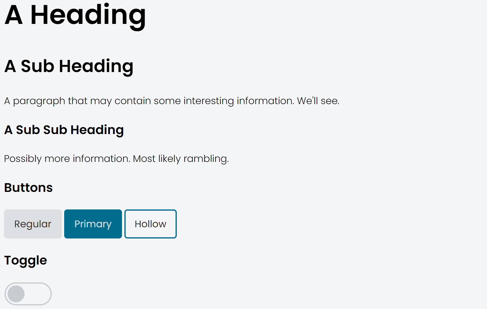

# lipu wan
Document Fragments

## Description
This is a component library that contains

- headers
- paragraphs
- buttons
- a toggle

and that's all.

This library is mostly an exercise to see how well the lipu-wan-tomo library works and it's not bad? I'm not sure anybody should use this but it was an interesting experiement.

## Image

